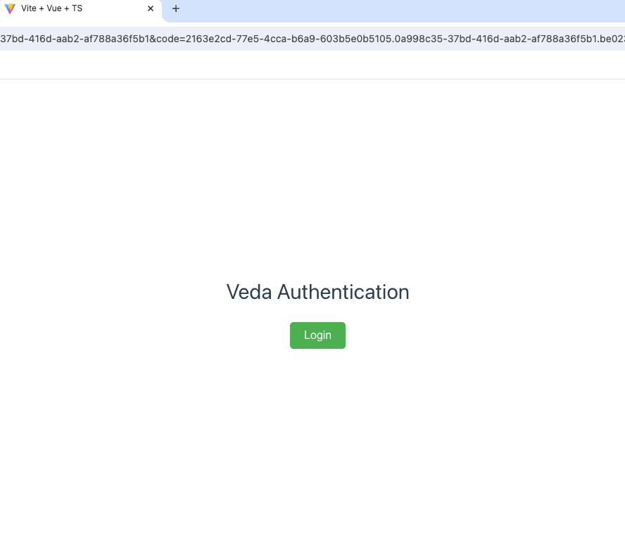
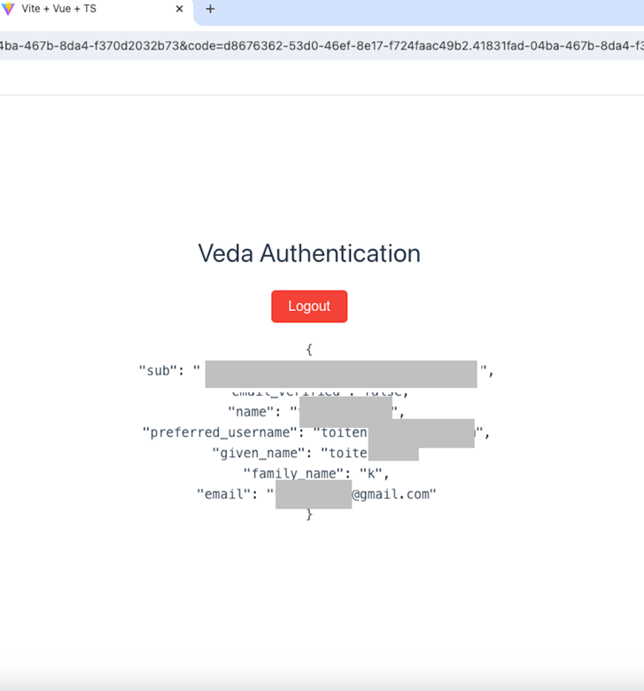

# Veda Authentication Vue SDK

### Demo with veda:
```
clone the project
npm install
update the config in main.js under sample2 foler
cd examples/sample2
npm run dev

```
* Make sure to add the redirect url in your keycloak client


```
click Login
```
* make sure veda application is running
* if authenticated correctly, you should see a logout button and your information displayed

* For a more detailed guide, please go to: [Vue Auth SDK Detailed Guide](https://docs.google.com/document/d/1Q2brRivCXxt0b1K_kou_Gqf6KXR9R0Kkn8ADevS9mig/edit?usp=sharing)

